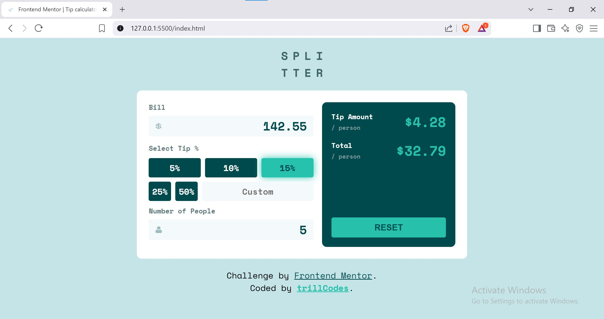

# Frontend Mentor - Tip calculator app solution

This is a solution to the [Tip calculator app challenge on Frontend Mentor](https://www.frontendmentor.io/challenges/tip-calculator-app-ugJNGbJUX). Frontend Mentor challenges help you improve your coding skills by building realistic projects.

## Welcome! 👋

Thanks for checking out this front-end coding challenge.

[Frontend Mentor](https://www.frontendmentor.io) challenges help you improve your coding skills by building realistic projects.

## Table of contents

- [Overview](#overview)
  - [The challenge](#the-challenge)
  - [Screenshot](#screenshot)
  - [Links](#links)
- [My process](#my-process)
  - [Built with](#built-with)
  - [What I learned](#what-i-learned)
  - [Continued development](#continued-development)
  - [Useful resources](#useful-resources)
- [Author](#author)
- [Acknowledgments](#acknowledgments)

## Overview

### Screenshot

### Links

- Solution URL: [Github repo to the code for the challenge](https://github.com/AllisonFavour/fm-challenge11)
- Live Site URL: [Vercel link to view the challenge](https://tip-calculator-one-virid.vercel.app)

## My process

### Built with

- Semantic HTML5 markup
- CSS custom properties and Flexbox
- Javascript

### What I learned

 

### Continued development

Ensure its responsiveness to a variety of screens and also ensure the email validation works properly

## Author

- Website - [Allison Favour](https://allison-favour-portfolio-darkmode.vercel.app/)
- Frontend Mentor - [@AllisonFavour](https://www.frontendmentor.io/profile/AllisonFavour)
- Twitter - [@TrillestOjay](https://x.com/TrillestOjay)

## Acknowledgments

Thanks to my resilience for being able to start and finish this project and thanks to frontend mentor for providing such a wonderful learning platform, lastly thanks to ChatGPT for code suggestions and ideas to complete the project.